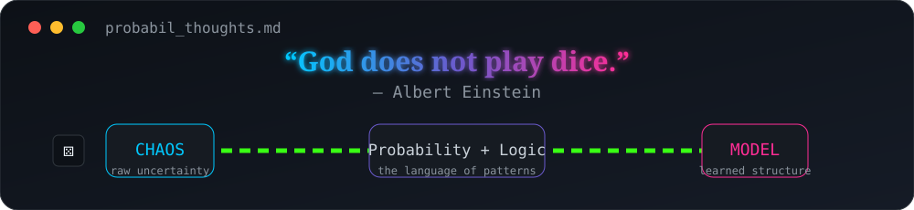

 

probabil = {
    "focus": ["AI", "Machine Learning", "Computer Vision", "NLP"],
    "thinking": "logic + probability + patience",
    "belief": "A prediction is easy. Reliability is engineering."
}

  

🤖 AI & ML Stack

 

📊 GitHub Diagnostics

 

🤝 Connect

  

Probabil — where logic meets uncertainty.

