 

eltun = ML_Engineer(focus=["AI", "NLP", "Computer Vision"])
while eltun.is_alive:
    eltun.learn().build().debug()

  

⚙️ Tech Stack

 

  

🧪 Developer Reality

<table>
<tr>
<td width="50%" align="center">
  
</td>
<td width="50%" align="center">
  
</td>
</tr>
</table>

📊 GitHub Diagnostics

 

🤝 Connect

  

May your loss decrease and your bugs reproduce only in controlled environments.

